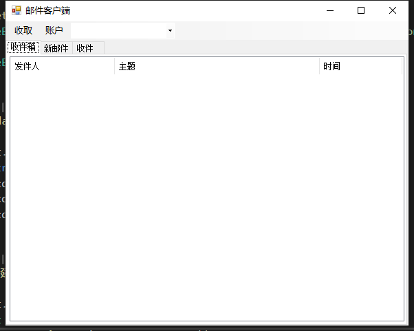
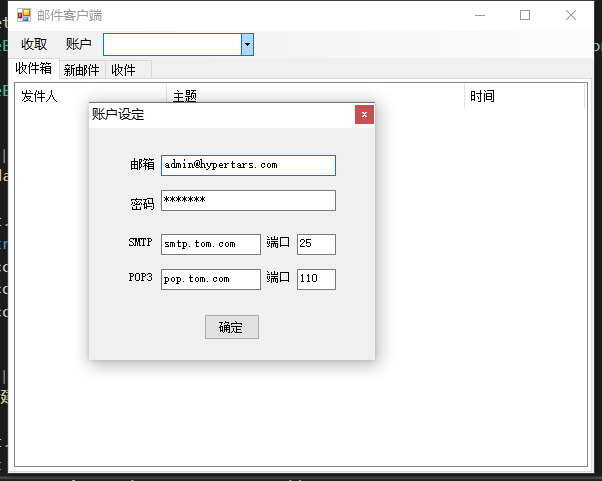
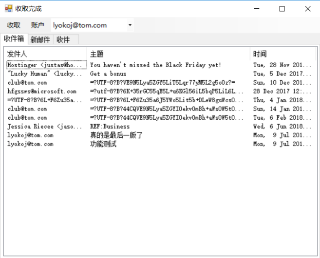
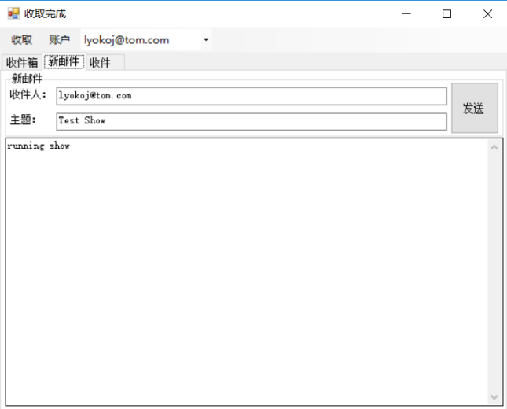
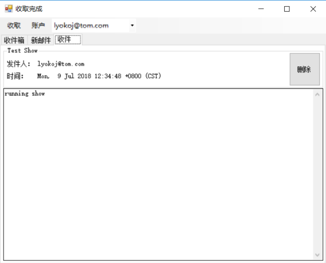

# Simle-Email-System

- Creation date: 07-09-2018 创建日期 2018-07-09

- This is a simple email system desktop application based on C# 这是一个基于C#的简单邮件系统桌面应用
    - Main Function 主要功能
        - User logs in 用户登录
        - Edit settings 修改设置
        - Receive email 接收邮件
        - Check email box 查看邮件箱
        - Send email 发送邮件
        - Delete email 删除邮件

- Support protocol 支持协议
    - POP3
    - SMTP

- Preview 概览
    - Main 主界面

        

    - New Account 新建账户

        

    - Email Box 邮件箱

        

    - Send and Receive Email 收发测试

        

        

- [See full report 查看完整报告](Report.pdf)